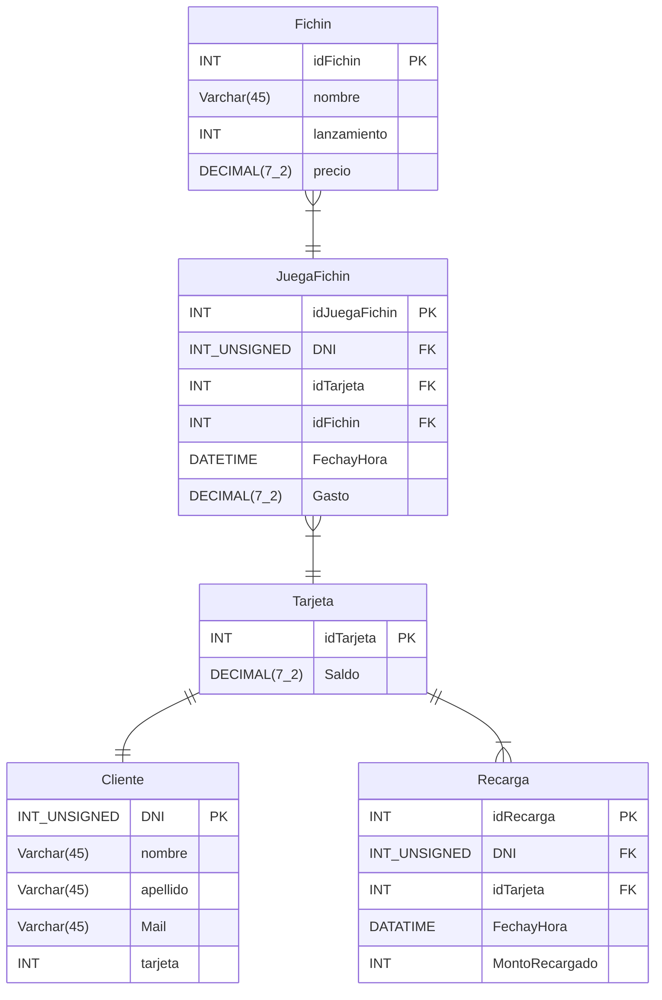

```mermaid
erDiagram
        Fichin{
            
            INT idFichin PK
            Varchar(45) nombre 
            INT lanzamiento 
            DECIMAL(7_2) precio 
        }
        Cliente{
            
            INT_UNSIGNED DNI PK
            Varchar(45) nombre 
            Varchar(45) apellido 
            Varchar(45) Mail 
            INT tarjeta 
        }
        Recarga{
            
            INT idRecarga PK
            INT_UNSIGNED DNI FK
            INT idTarjeta FK
            DATATIME FechayHora
            INT MontoRecargado
        }
        Tarjeta{

            INT idTarjeta PK
            DECIMAL(7_2) Saldo
        }
        JuegaFichin{
            
            INT idJuegaFichin PK
            INT_UNSIGNED DNI FK
            INT idTarjeta FK
            INT idFichin FK
            DATETIME FechayHora
            DECIMAL(7_2) Gasto
        }
    
        Tarjeta ||--|| Cliente : ""
        Tarjeta ||--|{ Recarga : ""
        JuegaFichin }|--|| Tarjeta : ""
        Fichin }|--|| JuegaFichin : ""
        

```